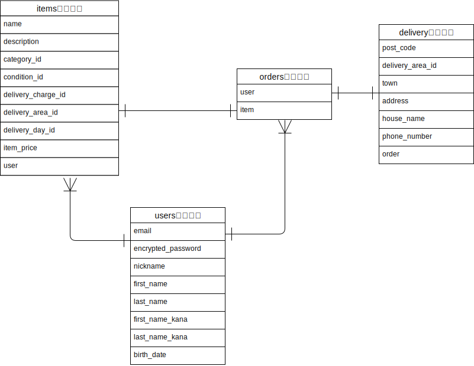

# アプリケーション名
 FURIMA（フリマアプリ）

# アプリケーション概要
ユーザーを登録すると商品を出品できます。自身が出品した商品は、編集と削除をすることができます。
他のユーザーが出品した商品は、クレジットカードを用いて購入することができます。

# URL
https://furima-38253.herokuapp.com/

# テスト用アカウント

- Basic認証

| ID       | pass    |
| -------- | ------- | 
| admin    | 2222    |

- テスト用アカウント

| user     | email    | password     |
| -------- | -------- | ------------ |
| 出品者用  | 1@test   | test1111     |
| 購入者用  | 2@test   | test2222     |

- クレジットカード情報

| 番号               | 期限      | セキュリティコード  |
| ----------------- | -------- | ---------------- |
| 4242424242424242  | 12/44    | 123              |

# 工夫した点
エラーの検索方法を工夫しました。
初めのうちは、やみくもにエラー文をそのまま検索して解決法を探していました。同じエラー文でも原因は様々であるため、なかなか自身が遭遇しているエラーに近い記事を見つけることができず、時間がかかっていました。
そこで、まずはエラー文の意味を理解し、デバックを使いエラーになっている箇所を特定することを意識しました。キーワードとエラー文を組み合わせて検索することで、自身が遭遇しているエラーの関連記事が出てくる確率がアップし、効率的にエラーを解決することができました。

# 苦労した点
Formオブジェクトパターンでの実装に苦労しました。
Formオブジェクトは初めて使う技術であったため、多くのエラー解決、コード修正を経験しました。コードの修正を繰り返すうちに、どのコードを修正する必要があるのか、どのコードを変更したのか、変更前に戻すときにどこを書き換えれば良いのか等、その都度整理するのに時間がかかってしまいました。
この経験から、実装に必要なコード（例えばカラムの追加、アソシエーション、ストロングパラメータ等）を書き出し、一つずつ実行、デバックを使い正しく機能していたらこまめにcommitすることを意識するようになりました。

# データベース設計

## users テーブル

| Column             | Type   | Options                   |
| ------------------ | ------ | ------------------------- |
| email              | string | null: false, unique: true |
| encrypted_password | string | null: false               |
| nickname           | string | null: false               |
| first_name         | string | null: false               |
| last_name          | string | null: false               |
| first_name_kana    | string | null: false               |
| last_name_kana     | string | null: false               |
| birth_date         | date   | null: false               |

### Association

- has_many :items
- has_many :orders

## items テーブル

| Column             | Type       | Options                        |
| ------------------ | ---------- | ------------------------------ |
| name               | string     | null: false                    |
| description        | text       | null: false                    |
| category_id        | integer    | null: false                    |
| condition_id       | integer    | null: false                    |
| delivery_charge_id | integer    | null: false                    |
| delivery_area_id   | integer    | null: false                    |
| delivery_day_id    | integer    | null: false                    |
| item_price         | integer    | null: false                    |
| user               | references | null: false, foreign_key: true |

### Association

- belongs_to :user
- has_one    :order

## orders テーブル

| Column       | Type       | Options                        |
| ------------ | ---------- | ------------------------------ |
| user         | references | null: false, foreign_key: true |
| item         | references | null: false, foreign_key: true |

### Association

- belongs_to :user
- belongs_to :item
- has_one    :delivery
- has_one    :card

## delivery テーブル

| Column            | Type       | Options                        |
| ----------------- | ---------- | ------------------------------ |
| post_code         | string     | null: false                    |
| delivery_area_id  | integer    | null: false                    |
| town              | string     | null: false                    |
| address           | string     | null: false                    |
| house_name        | string     |                                |
| phone_number      | integer    | null: false                    |
| order             | references | null: false, foreign_key: true |

### Association

- belongs_to :order

# 開発環境
- フロントエンド

&emsp; HTML, CSS

- バックエンド

&emsp; Ruby on Rails(Ruby)

- インフラ

&emsp; Heroku, AWS(S3)

- OS

&emsp; Mac/Linux

- データベース

&emsp; MySQL

- タスク管理

&emsp; Github
